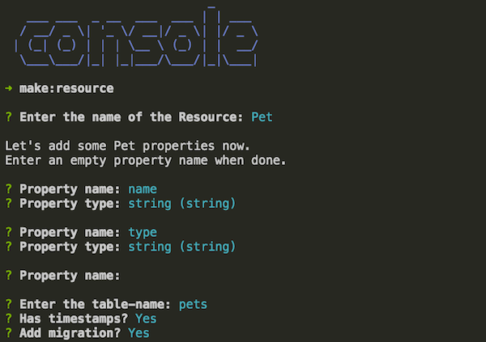

# Express Typescript Boilerplate
[](https://david-dm.org/w3tecch/express-typescript-boilerplate) [](https://travis-ci.org/w3tecch/express-typescript-boilerplate)

> A delightful way to building a RESTful API with NodeJs & TypeScript.

> An Node.js RESTful API boilerplate featuring
[Express](https://expressjs.com/),
[Inversify](http://inversify.io/),
[Winston](https://github.com/winstonjs/winston),
[TypeScript](https://www.typescriptlang.org/),
[TsLint](http://palantir.github.io/tslint/),
[@types](https://www.npmjs.com/~types),
[Jest](https://facebook.github.io/jest/),
[Swagger](http://swagger.io/),
[validatejs](https://validatejs.org/),
[knex](http://knexjs.org/) and
[bookshelf](http://bookshelfjs.org/)
by [w3tech](https://github.com/w3tecch)

## Why
Our main goal with this project is a feature complete server application.
We like you to be focused on your business and not spending hours in project configuration.

Try it!! We are happy to hear your feedback or any kind of new features.

## Features
- **Beautiful Syntax** thanks to the awesome annotations from [Inversify Express Utils](https://github.com/inversify/inversify-express-utils).
- **Easy API Testing** with included black-box testing.
- **Dependency Injection** done with the nice framework from [Inversify](http://inversify.io/).
- **Fast Database Building** with simple migration and seeding from [Knex](http://knexjs.org/).
- **Simplified Database Query** with the ORM of [Knex](http://knexjs.org/) called [Bookshelf](http://bookshelfjs.org/).
- **Clear Structure** with controllers, services, repositories, models, middlewares...
- **Easy Exception Handling** with our own simple and easy to adopt logic. You will love it.
- **Easy Data Seeding** with our own factories.
- **Custom Commands** are also available in our setup and really easy to use or even extend.
- **Scaffolding Commands** will speed up your development tremendously as you should focus on business code and not scaffolding.
- **Smart Validation** thanks to [class-validator](https://github.com/pleerock/class-validator) with some nice annotations.
- **API Documentation** thanks to [swagger](http://swagger.io/).
- **API Monitoring** thanks to [express-status-monitor](https://github.com/RafalWilinski/express-status-monitor).
- **Integrated Testing Tool** thanks to [Wallaby.js](https://wallabyjs.com/)

## Getting Started
### Step 1:  Set up the Development Environment
You need to set up your development environment before you can do anything.

Install [Node.js and NPM](https://nodejs.org/en/download/)
* on OSX use [homebrew](http://brew.sh) `brew install node`
* on Windows use [chocolatey](https://chocolatey.org/) `choco install nodejs`

Install yarn globally
```
npm install yarn -g
```

Install a MySQL database.

> If you work with a mac, we recommend to use homebrew for the installation.

### Step 2: Create new Project
Fork or download this project. Configure your package.json for your new project.

Then copy the `example.env` file and rename it to `.env`. In this file you have to add your database connection information.

Create a new database with the name you have in your `.env`-file.

Then setup your application environment.
```
npm run setup
```

> This installs all dependencies with yarn. After that it migrates the database and seeds some test data into it. So after that your development environment is ready to use.

### Step 3: Serve your App
Go to the project dir and start your app with this npm script.
```
npm run serve
```

> This starts a local server using `nodemon`, which will watch for any file changes and will restart the sever according to these changes.
> The server address will be displayed to you as `http://0.0.0.0:3000`.

### Step 4: Create a new Resource
Go to the project dir and hit this command in your terminal.
```
npm run console make:resource
```

Apply the same information like you see in the screenshot below.



> With that you just have created a complete new endpoint in your api for the resource pets.

Normally a pet belogns to a user, so we have to add the relationship between users an pets. Open the created migration file and replace the user property with these lines.
```
table.integer('user_id').unsigned();
table.foreign('user_id').references('id').inTable('users').onDelete('cascade');
```

Next we have to add this relationship also in the pets model.
```
public user(): User {
    return this.belongsTo(User);
}
```

> The relationship between the users and pets are set and ready. So you can migrate your database with `npm run db:migrate`

### Step 5: Create a Seeder
To seed some cute pets we need a smart factory. So open the ./src/database/factories/index.ts and add this code.
```
/**
 * PET - Factory
 */
factory.define(Pet, (faker: Faker.FakerStatic, args: any[]) => {
    const type = args[0];
    return {
        name: faker.name.firstName(),
        type: type || 'dog',
        userId: factory.get(User).returning('id')
    };
});
```

> This factory helps us to create a fake pet to seed to the database.

Run this command in your terminal and call the new seeder `create pets`.
```
npm run console make:seed
```

Open the file and place this code into it.
```
await factory.get(Pet)
    .create(10);
```

> Now we can seed some nice cats into the database with `npm run db:seed`.

> That was easy! Now its your turn to make something great out of it.

## Scripts / Tasks
All script are defined in the package.json file, but the most important ones are listed here.

### Install
* Install all dependencies with `yarn install`

### Linting
* Run code quality analysis using `npm run lint`. This runs tslint.
* There is also a vscode task for this called `lint`.

### Tests
* Run the unit tests using `npm test` (There is also a vscode task for this called `test`).
* Run the black-box tests using `npm run test:black-box` and don't forget to start your application and your [Auth0 Mock Server](https://github.com/hirsch88/auth0-mock-server).

### Running in dev mode
* Run `npm run serve` to start nodemon with ts-node, to serve the app.
* The server address will be displayed to you as `http://0.0.0.0:3000`

### Building the project and run it
* Run `npm run build` to generated all JavaScript files from the TypeScript sources (There is also a vscode task for this called `build`).
* To start the builded app located in `dist` use `npm start`.

### Database
* Run `npm run db:migrate` to migrate schema changes to the database
* Run `npm run db:migrate:rollback` to rollback one migration
* Run `npm run db:seed` to seed sample data into the database
* Run `npm run db:reset` to rollback all migrations and migrate any migration again

### Console
* To run your own created command enter `npm run console <command-name>`.
* This list all your created commands `npm run console:help`.

### Scaffolding Commands
All the templates for the commands are located in `src/console/templates`.

* `npm run console make:resource <file>` - Generates a controller, service, requests, repo, model and a migration with CRUD operations.
* `npm run console make:controller <file>` - Generates a controller.
* `npm run console make:service <file>` - Generates a service.
* `npm run console make:repo <file>` - Generates a repository.
* `npm run console make:model <file>` - Generates a model with the props and configurations.
* `npm run console make:middleware <file>` - Generates a basic middleware.
* `npm run console make:request <file>` - Generates a basic request.
* `npm run console make:listener <file>` - Generates a basic listener.
* `npm run console make:exception <file>` - Generates a basic exception.
* `npm run console update:targets <file>` - Reads all the API files and generate a new `constants/Targets.ts` file out of it.

**Example**
```
$ npm run console make:controller auth/auth
// -> creates `api/controllers/auth/AuthController.ts

$ npm run console make:model user
// -> creates `api/models/User.ts
```

## IoC
Our IoC automatically looks through the `controllers`, `listeners` , `middlewares`, `services`,
`repositories` and `models` folders in `src/api/` for files to bound automatically into the IoC - Container, so you have nothing to do.

**However it is very important to keep the naming right, because otherwise our IoC will not find your
created files!!**

## Using the debugger in VS Code
Just set a breakpoint and hit `F5` in your Visual Studio Code.

## API Routes
The route prefix is `/api` by default, but you can change this in the .env file.

| Route       | Description |
| ----------- | ----------- |
| **/api/info**   | Shows us the name, description and the version of the package.json |
| **/api/docs**   | This is the Swagger UI with our API documentation |
| **/status** | Shows a small monitor page for the server |

## Project Structure

| Name                          | Description |
| ----------------------------- | ----------- |
| **.vscode/**                  | VSCode tasks, launch configuration and some other settings |
| **dist/**                     | Compiled source files will be placed here |
| **src/**                      | Source files |
| **src/api/controllers/**      | REST API Controllers |
| **src/api/exceptions/**       | Exceptions like 404 NotFound |
| **src/api/listeners/**        | Event listeners |
| **src/api/middlewares/**      | Express Middlewares like populateUser |
| **src/api/models/**           | Bookshelf Models |
| **src/api/repositories/**     | Repository / DB layer |
| **src/api/requests/**         | Request bodys with validations |
| **src/api/services/**         | Service layer |
| **src/api/** swagger.json     | Swagger documentation |
| **src/console/**              | Command line scripts |
| **src/config/**               | Configurations like database or logger |
| **src/constants/**            | Global Constants |
| **src/core/**                 | The core framework |
| **src/database/factories/**   | Model factories to generate database records |
| **src/database/migrations/**  | Migrations scripts to build up the database schema |
| **src/database/seeds/**       | Seed scripts to fake sample data into the database |
| **src/public/**               | Static assets (fonts, css, js, img). |
| **src/types/** *.d.ts         | Custom type definitions and files that aren't on DefinitelyTyped |
| **test**                      | Tests |
| **test/black-box/** *.test.ts | Black-Box tests (like e2e) |
| **test/unit/** *.test.ts      | Unit tests |
| .env.example                  | Environment configurations |
| knexfile.ts                   | This file is used for the migrations and seed task of knex |

## Related Projects
* [Microsoft/TypeScript-Node-Starter](https://github.com/Microsoft/TypeScript-Node-Starter) - A starter template for TypeScript and Node with a detailed README describing how to use the two together.
* [express-graphql-typescript-boilerplate](https://github.com/w3tecch/express-graphql-typescript-boilerplate) - A starter kit for building amazing GraphQL API's with TypeScript and express by @w3tecch
* [aurelia-typescript-boilerplate](https://github.com/w3tecch/aurelia-typescript-boilerplate) - An Aurelia starter kit with TypeScript
* [Auth0 Mock Server](https://github.com/hirsch88/auth0-mock-server) - Useful for black-box testing or faking an oAuth server

## Documentations of our main dependencies
* [Express](https://expressjs.com/)
* [Knex](http://knexjs.org/)
* [Bookshelf](http://bookshelfjs.org/)
* [Bookshelf Cheatsheet](http://ricostacruz.com/cheatsheets/bookshelf.html)
* [Inversify](http://inversify.io/)
* [Inversify Express Utils](https://github.com/inversify/inversify-express-utils)
* [class-validator](https://github.com/pleerock/class-validator)
* [Jest](http://facebook.github.io/jest/)
* [Auth0 API Documentation](https://auth0.com/docs/api/management/v2)
* [swagger Documentation](http://swagger.io/)

## License
 [MIT](/LICENSE)

---
Made with ♥ by w3tech ([w3tech](https://github.com/w3tecch)), Gery Hirschfeld ([@GeryHirschfeld1](https://twitter.com/GeryHirschfeld1)) and [contributors](https://github.com/w3tecch/express-typescript-boilerplate/graphs/contributors)
